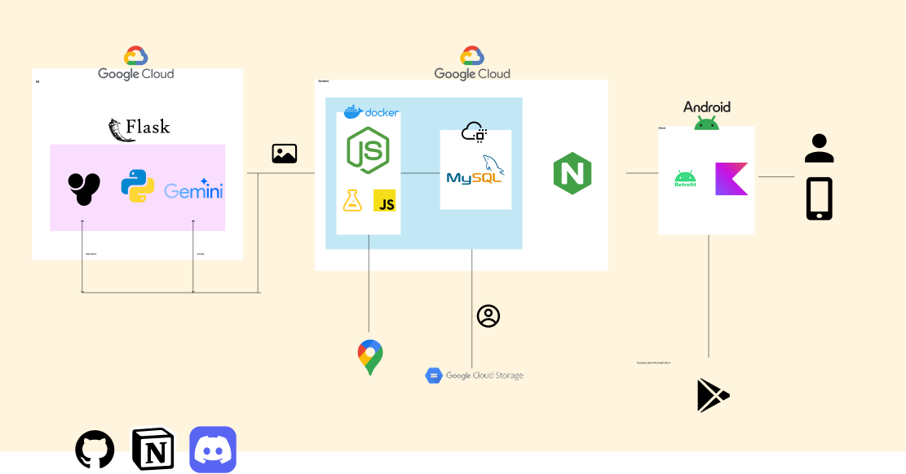
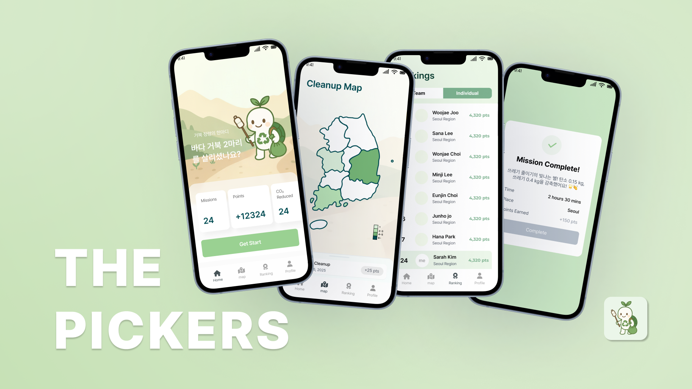

# Backend

THE PICKERS's backend repository
<<<<<<< main

## Architecture

* 구글클라우드 인프라라 기반 구동, docker로 서비스 배포
* Nodejs(v23.0.0) + javascript esModule system
* RESTful API 설계, Test 기반 앱 개발
* MySQL, Prisma ORM + Google Cloud SQL 로 DB관리
* 서버내부 NGINX 구축, HTTPS 인증 구현
* Google Cloud Storage, Google MAPS 추후 도입으로 기능 확장예정

---

=======
>>>>>>> main
